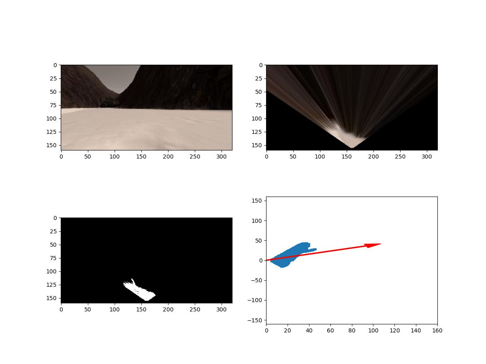
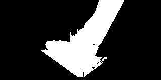
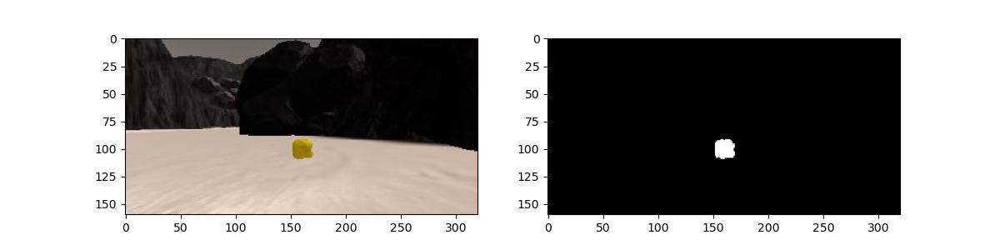

# Digital image processing Project: NASA Search and Sample Return

## Run the Code
You can test out the simulator by opening it up and choosing "Training Mode."

To run the automated code included in this repository:
* Activate the conda environment with `conda activate environmentName` 
* Run `python ./code/drive_rover.py` to start the code (this communicates with the simulator directly)
* Start the simulator (double click `Roversim.x86_64` or `Roversim.x86`) and choose "Autonomous Mode."

## Notebook Analysis
This [Jupyter Notebook](./code/Rover_Project_Test_Notebook.ipynb) includes all of the major functions, which are broken out into individual sections as follows:

## Color Thresholding for the navigalbe terrain, the obstacles and sample rocks

### color_thresh:
It takes an image as parameter and the threshold we want to use with respect to three channels: red, green, and blue. It returns the binary image after thresholding.

### rock_thresh:
It takes an image for a rock as parameter and converts BGR to HSV, and define range of yellow colors in HSV, then threshold the HSV image to get only yellow colors.

### rover_coords
It takes the binary image as parameter and translates its position from the image coordinates to the rover coordinates. It returns the x and y positions after the translation.

### to_polar_coords
It takes the returned positions from the rover_coords and changes it to polar coordinates that is to say distances and angles.

### rotate_pix
This function takes the x pixel position and y pixel position in addition to the yaw of the rotation. It returns the rotated pixel.

### translate_pix
Its job is to determine the actual pixel of the map.

### pix_to_world
It uses the rotation of the pixel, translation and clipping of the pixel all at once. Afterwards it returns x pixel and the y pixel in world map.

### perspect_transform
It transforms the vision of the rover into bird eye view image scaled.

### perception_step
Here we:
1) Define source and destination points for perspective transform.
2) Apply perspective transform.

3) Apply color threshold to identify navigable terrain/obstacles/rock samples.
4) Update Rover.vision_image (this will be displayed on left side of screen).
5) Convert map image pixel values to rover-centric coords.
6) Convert rover-centric pixel values to world coordinates.
7) Update Rover world map (to be displayed on right side of screen).
8) Convert rover-centric pixel positions to polar coordinates.
9) Check if a rock is identified, then make the rover navigate to it.

 

### Decision
The `decision.py` file includes all of the code used by the rover for decision making. It takes the data from `perception.py` and determines what actions it should make.

The main areas within the file are the forward, stop and stuck sections.

#### Forward, stop and stuck
* The forward mode: in this mode the rover moves with a given speed and throttle if the road is clear.
* The stuck mode: it is implemented inside the forward mode to make the rover able to detect if it is stuck and make a decision to get out of the stuck position by steering to the left or to the right.
* The stop mode: in this mode, the rover decides to stop if the road isn't clear. We set the throttle to zero, steering angle to zero, and the brake to max value.

## The attributes added in the pipeline:
1) start_pos: used in perception step to save the start position of the rover.
2) spinning_time: used in decision step to calculate that the time the rover spent spinning in same place.
3) max_spinning_time: used in decision step to compare if the spinning time of the rover exceeds the max spinning time.
4) samples_found: used in decision step to save the number of rocks that rover found.
5) sample_timer: used in decision step to save the time for when the sample was first seen.
6) sample_max_search: used in decision step to indicates max seconds allowed to get the seen sample.
7) sample_seen: a flag used in decision step, turns true when a sample is detected.
8) rock_angle: used in perception step and decision step to track the angle to the sample.
9) rock_dist: used in perception step and decision step to track the distance to the sample.
10) max_stuck: max allowed time for rover to not move.
11)stuck_time: time with no velocity but throttle set.
12) mapped_percentage: used in decision step to check if the mapped percentage exceeds 95%.
